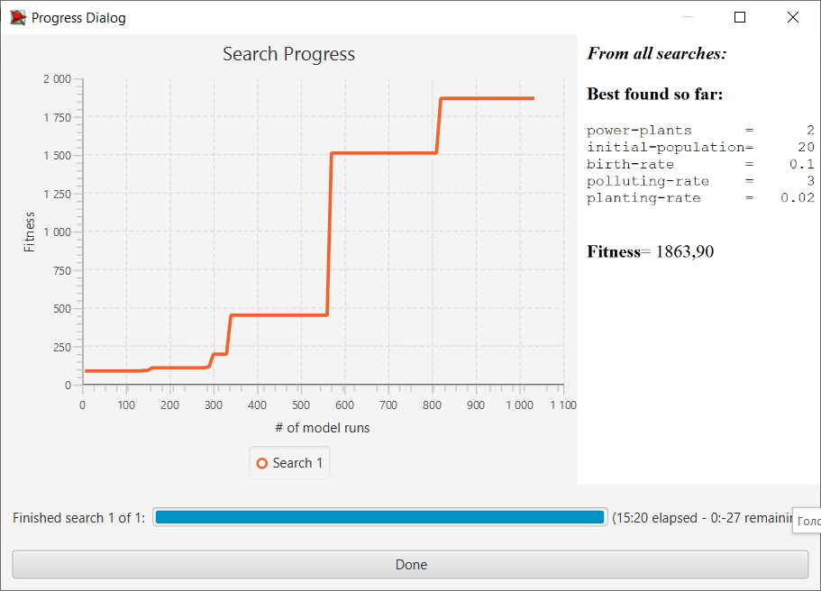

## Комп'ютерні системи імітаційного моделювання
## СПм-23-5, **Головченко Олександр Сергійович**
### ### Лабораторна робота №**3**. Використання засобів обчислювального интелекту для оптимізації імітаційних моделей

<br>

### Варіант 4, модель у середовищі NetLogo:
[Urban Suite - Pollution](http://www.netlogoweb.org/launch#http://www.netlogoweb.org/assets/modelslib/Curricular%20Models/Urban%20Suite/Urban%20Suite%20-%20Pollution.nlogo).

<br>
Оскільки, та ж модель використовувалася і у двох попередніх роботах, то приводити її вербальній опис сенсу немає. Її керуєчими параметрами є:
- **initial-population** визначає кількість агентів-людей у серидовищі моделювання на момент запуску моделі.
- **bitrth-rate** визначає вірогідність/рік того, що людна породить нащадка 
- **planting-rate** візначає вірогідність/рік того, що людина посадить дерево
- **power-plants** визначає кількість електростаній (джерел забруднення) у серидовищі моделювання
- **polluting-rate** визначає рівень забруднення яке кожна станція виробляє протягом року.

В якості показників роботи виступають:
- Pop trees. Популяція дерев.
- Pop people. Популяція людей.
- Pop pollution. Рівень забруднення (позначений як популяція забруднення).
- Time. Час виживання людської популяції.

Слід зазначити, що час не відслідковується на пряму, а скоріше виступає як вимір, тобто шкала по осі Х для інших трьох показників. Однак дана модель має ряд особливостей через які саме час можна вважати основним параметром. По перше: забрунення практично не проявляється. При високій чисельності людства і за умови ненульового рівня висаджування дерев цей параметр швидко скочується до близьких до нуля (і нульових) значень. По друге: за високих значень чисельності агентів людей (близько 20000 у веб-версії і від 40000 у десктопній) та дерев модель починає підвисати, тобто виконання інструкцій на кожному тику сильно затягується. Оскільки алгоритми пошуку у BihaviorSearch пропонують лише мінімізацію або максимізацію обраної метрики, то выдповыдно чисельності дерев і людства нам не підходять. Першого можна добитися і без підбору всього двома параметрами (за умови що відмінено завершення симуляціїї за умови щезання людства), другого усього одним параметром але модель сильно зависатиме.

Отже будемо намагатися оптимізувати час виживання людства з допомогою алгитмів автоматичного пошуку. 

Проте, метрику часу, як таку ввести у поле Measure BehaviorSearch неможливо (принаймні не знайдено варіанту як че зробити без змін у самій моделі). Тому спочатку внесемо деякі зміни у модель. А саме визначимо змінну, яку можна буде витягти до BihaviorSearchю.


```
breed [ people person ]  
breed [ trees tree ]  
  
turtles-own [ health ]  
  
patches-own [  
  pollution  
  is-power-plant?  
]  
  
globals [people-survival-time]  ;;додано
  
to setup  
  clear-all  
  
  set-default-shape people "person"  
  set-default-shape trees "tree"  
  
  ask patches [  
    set pollution 0  
    set is-power-plant? false  
  ]  
  
  create-power-plants  
  
  ask patches [ pollute ]  
  
  create-people initial-population [  
    set color black  
    setxy random-pxcor random-pycor  
    set health 5  
  ]  
  
  set people-survival-time 0   ;;додано
  reset-ticks  
    
end  
  
to go  
  
  if any? turtles with [breed = people] [  ;;додано
    set people-survival-time ticks  
  ]
  ...
```
Внесемо даний параметр на графік, щоб перевірити:

![[im20241120165234.png]]

З попереднього рисунку робимо висновок, що нова метрика більщ-менш відповідає задуманому, тобто відображує кількість тиків виживання людства.

Отже тепер можна переходити до налаштувань автоматизованого пошуку.

### Налаштування BehaviorSearch:

Для початку збережемо, змінену модель в окремову файлі і в BihaviorSearch вкажемо шлях жо даного файлу .nlogo. Після чого натисненням відповідної кнопки, підтягнемо до середовища керуючі параметри моделі. 


В даному випадку є необхідність пояснити вибір деяких параметрів. Технічно, може виникнути конфлікт між Measure та Step limit. Але осныльки час роботи моделі є найадекватнішою метрикою для пошуку, то орієнтуючись на те, що у веб версії ніколи не доводилося побачити результат більший за 1,5 тисячи тиків, то припустимо, що 10000 тиків мають покрити більшу частину тестів. Інакше вважатимемо, що задачею було максимально наблизитися до значення 10 тисяч тиків. Також встановимо обмеження, що симуляцію слід зупинити при чисельності людства у 25 тисяч особин. Так робимо задля того, щоб не очікувати рішення для підвисаючої моделі. З тих же причин максимальний рівень народжуваності зменшено до 0.1 замість 0.2. А діапазон значень кількості електростанцій зменшеено до 5.


На другій вкладці зміни взагалі не потрібні, оскільки, необхідне значення ми отримаємо тільки наприкінці симуляції, воно сильно залежить від випадковості (тому доцільно брати середнє значення з 10 симуляцій) і ми максимізуємо значення.

Першим виконуватимемо випадковий пошук. Для нього необхідно змінити тип алгоритму у випадаючому списку. Кількість запусків моделі поставимо як у прикладі 1000.


Результати випадкового пошуку такі:


Далі зробимо пошук з генетичним алгоритмом. Всі параметри залишимо як є. 



З огляду на те, що генетичний алгоритм виявив рышення гырше за звичайний випадковий пошук, мабуть слыд пояснити. Справа у тому, що дуже велику роль і у самій моделі і при пошуку відіграє рандом. Це означає що гіпотетично перше ж запропоноване рішення може бути чи не ідеальним, або ж можуть бути знайдені тільки такі рішення які не становлять і 10-ї частини істиного розв'язку. Також доцільно зазначити, що у хоча ми і використали середнє значення з десяти запусків, проте через великий впплив рандому на саму модель це ніяк не гарантує знаходження кращих рішень і вцілому здатне навіть їх погіршити.  

Наприклад так виглядають деякы з графіків отриманы при моделюванні з параметрами знайденими генетичним алгоритмом.


