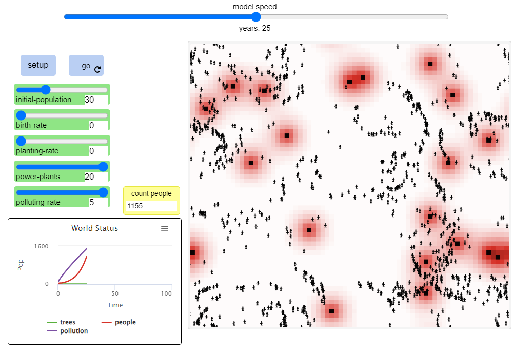
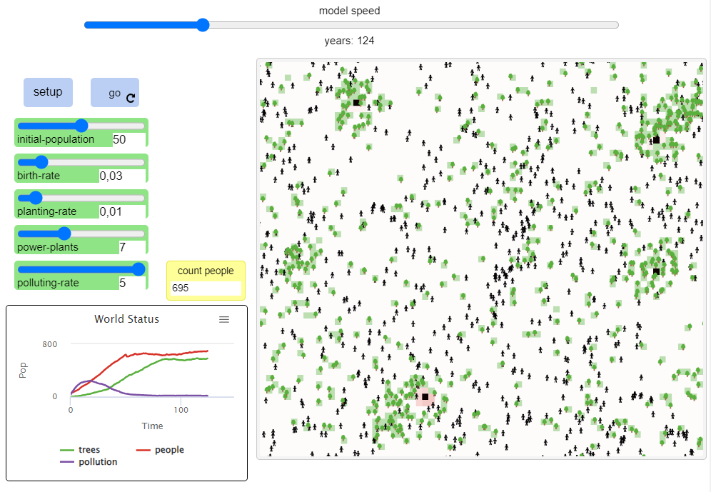

## Комп'ютерні системи імітаційного моделювання
## СПм-23-5, **Головченко Олександр Сергійович**
### Лабораторна робота №**2**. Редагування імітаційних моделей у середовищі NetLogo

<br>

### Варіант 4, модель у середовищі NetLogo:
[Urban Suite - Pollution](http://www.netlogoweb.org/launch#http://www.netlogoweb.org/assets/modelslib/Curricular%20Models/Urban%20Suite/Urban%20Suite%20-%20Pollution.nlogo).

<br>
### З отриманим кодом можно ознайомитися 
[Тут](Cod)
<br>

### Внесені зміни у вихідну логіку моделі, за варіантом:

**Реалізацію позитивного вплив наявності на імітаційному полі електростанцій на вірогідність появи нових людей**. інтерпетуватимемо так: чим більше на імітаційному полі електростанцій тим вищим має бути фактичний параметр **birth-rate**.

Додамо в код глобальну змінну **br-rt** на початку коду:

```
globals [br-rt]
```

Дана змінна виконуватиме функції **birth-rate**. У процедурі *setup* встановимо залежність між кількістю електростанцій і параметром **br-rt**:


```
set br-rt birth-rate + power-plants / 100
```

Оскільки параметр **power-plants** може приймати значення від нуля до 20 (0-20), то модифікатор параметру **birth-rate** коливатметься від нуля до 0,2 (0-0,2). Тобто мінімальний модифікатор нуль, а максимальний дорівнює максимально можливому значенню **birth-rate**.

Відповідно у процедурі *reproduce* параметр **birth-rate** заміняємо на **br-rt**:

```
to reproduce  ;; person procedure
  if health > 4 and random-float 1 < br-rt [
    hatch-people 1 [
      set health 5
    ]
  ]
end
```

Перевіримо функціональність внесених змін:

 
З рисунка видно, що хоча **birth-rate** дорівнює нулю, проте попуяція людей росте. Значить внесені зміни працездатні. Хоча тут можна було б поміркувати над тим чи повинна кількість електростанцій збільшувати нульовий рівень народжуваності, проте фактично це не має великого сенсу розглядати, оскільки код би не сильно ускладнився (у функції *setup* додалася б одна конструкція ifelse)

**Збільшити вірогідність висадки дерев у клітинах поблизу електростанцій** можна щонайменше двома способами. Перший передбачає перевірку наявності електростанціїї поблизу в процедурі maybe-plant:

```
to maybe-plant ;; person procedure 

let p_rate_mod planting-rate
  
if any? patches in-radius 4 with [is-power-plant?]
[
  set p_rate_mod planting-rate + 0.1
] 
if random-float 1 < p_rate_mod 
[ 
	hatch-trees 1 
	[ 
		set health 5 set color green 
	] 
]

end
```

З наступного рисунку видно, що результатом такої зміни стає поява більш щільних зелених насаджень біля станцій.



Проблема такого підходу полягає у тому, що дана перевірка буде виконуватися кодним агентом людиною на кожному тику. А оскільки інструкції тут виконуються послідовно, то такий підхід може призвести до виникнення зайвих підторможувань.

Тому такий підхід не підходить для даної моделі з великим числом агентів. Скористаємося іншим варіантом. Відмітимо патчі біля електростанцій і якщо в момент виклику процедури висадки дерев людина знаходиться на такому патчі то вірогідність висадки підвищується.

Для реалізаціїї даного підходу додамо до властивостей патчів властивість **near**

```
patches-own [
  pollution
  is-power-plant?
  near
]
```

До процедури *create-power-plants* додаэмо виклик процедури *mark-nearby-patches*:

```
to create-power-plants
  ask n-of power-plants patches [
    set is-power-plant? true
  ]
  mark-nearby-patches
end
```

І прописуємо саму процедуру  *mark-nearby-patches*:

```
to mark-nearby-patches ;; Процедура для встановлення параметра "near" на патчах, в радіусі 4 від электрост.
  ask patches with [is-power-plant?] [
    ask patches in-radius 4 [
      set near 1
    ]
  ]
end
```

Залищилося внести відповідні зміни для врахування параметру **near** в процедуру *maybe-plant*:

```
to maybe-plant  ;; person procedure
  let p_rate_mod planting-rate
  if near = 1 
  [
    set p_rate_mod planting-rate + 0.1
  ]
  if random-float 1 < p_rate_mod [ 
    hatch-trees 1 [
      	set health 5
      	set color green
    ]
  ]
end
```

На наступному рисунку можемо побачити результат внесення вищезазначених змін.


<br>
### Внесені зміни у вихідну логіку моделі, на власний розсуд:

В рамках першох ЛБ вказувалося, що розглядувана модель має недоліки, зокрема те, що агенти люди розмножуються клонуванням, і без необхідності перебування поруч принаймні двох людей. 

Проте виправлення цього недоліку є дещо проблематичним. Справа в тому що спосіб перевірки наявності поблизу іншої людини нескладний і вже розглядався вище коли виконувалася перевірка наявності поблизу електростанцій. Його можна виконати так: 

```
if any? other people in-radius 1 [ ;;вииклик процедури reproduce ]
```

На жаль, ми не будемо виконувати цієї перевірки оскільки це збільшить час опитування агентів на кожному тику і викличе додаткові підторможування.

Проте реалізуємо іншу ідею. **Розподілимо людей на статі**. Відповідно тільки люди однієї з двох статей зможуть створювати нащадків. Проте для того щоб уникнути вимирання через занадто малу кількість нащадків шанс створення нащадка буде підвищено.

Спочатку додамо параметр статі агентам:

```
turtles-own [ health sex]
```

Модифікуємо доданий раніше параметр **br-rt** у процедурі *setup* :

```
;; шанс народження збільшено у 1.6 рази оскільки тільки для однієї статі + модифікатор за кількість станцій
  set br-rt birth-rate * 1.6 + power-plants / 100 
```

Далі вносимо зміни у *create-people initial-population*, а саме прибираємо фарбування чоловічків у чорний колір і заміняємо на фарбування у два кольори і встановлення парметру статі в залежності від рандомного числа:

```
create-people initial-population [
    ;;set color black
    setxy random-pxcor random-pycor
    set health 5
    
    ifelse random-float 1 < 0.5 [
      set sex "male"
      set color blue
      
    ] [
      set sex "female"
      set color pink
     ;; set health 0.1
    ]
  ]
```

Такі самі зміни вносимо до процедури *reproduce*:

```
to reproduce  ;; person procedure if health > 2.5 and health < 4 and random-float 1 < br-rt
   
  if health > 4 and random-float 1 < br-rt [
    hatch-people 1 [
      set health 5
      
      ifelse random-float 1 < 0.5 [
        set sex "male"
        set color blue
      ] [
        set sex "female"
        set color pink
      ]
    ]
  ]
end
```

Нарешті у циклічній процедурі *to go* переписуємо опитування людей додаючи залежність виклику процедури відтворення від статі

```
ask people [
    wander
    ;;if count people < 2000 [ if sex = "female" [ reproduce ] ]
    if sex = "female" [ reproduce ] 
    maybe-plant
    eat-pollution
    maybe-die
  ]
```

Результат змін може бути неочевидним проте дуже швидко візуалізується якщо задати чоловікам або жінкам дуже маленьку протяжність життя. 

Подібні зміни можуть бути корисні для внесення подальших, глобальніших змін. Як приклад задання різних можелей поведінки, різної протяжності життя, додавання нових видів активностей агентам і т.п.

## Обчислювальний експеримент

За аналогією до першої л/р проведемо експеримент з **Дослідження впливу кількості електростанцій на час існування людства.** Даний експеримент цікавий хоча б і тим, що минулого разу чисельність людства ніяк не була пов'язана з кількістю електроястанцій, зате електростянції знижували протяжність життя. А тому можна було, вцілому, бачити тенденцію до зниження часу виживання людей при збільшенні числа станцій. Наразі ж збільшення кількості станцій має призводити до більш стрімкого збільшення чисельності людської популяції, в той час як збільшена вірогідність висадки дерев біля станцій ефективніше гаситиме рівень забруднення.

Протягом експерименту значення керуючого параметру **power-plants** змінюється від 1 до 15 з кроком 2. При цьому рівень **polluting-rate** встановлений максимальний, тобто 5. Однак, оскільки тепер кількість станцій конвертується в рівень народжуваності (а проблеми з його тестуванням вже описувалися в л/р 1), то встановимо початковий **bitrth-rate**: 0,05. Інші керуючі параметри мають значення за замовчуванням:
- **initial-population**: 30
- **planting-rate**: 0,05
- **power-plants**: 2

| Кількість електростанцій | Час існування людства, роки<br>(початкова версія) | Час існування людства, роки<br>(модифікована версія) |
| ------------------------ | ------------------------------------------------- | ---------------------------------------------------- |
| 1                        | 99                                                | 78                                                   |
| 3                        | 81                                                | 80                                                   |
| 5                        | 67                                                | 126                                                  |
| 7                        | 78                                                | 117                                                  |
| 9                        | 76                                                | 125                                                  |
| 11                       | 87                                                | 581                                                  |
| 13                       | 65                                                | 348                                                  |
| 15                       | -                                                 | -                                                    |

Тест з 15 електростанціями провести не вдалося через заторможування.


З рисунку видно, що хоча в обох варіантах програми фіксуються сплески значень (викликано вірогідно рандомом), але простежуються дві протилежні тенденції: скорочення часу виживання людства при збільшенні кількості станцій у вихідному варіанті, та зростання часу виживання людства при тих же умовах у модифікованій версії.
